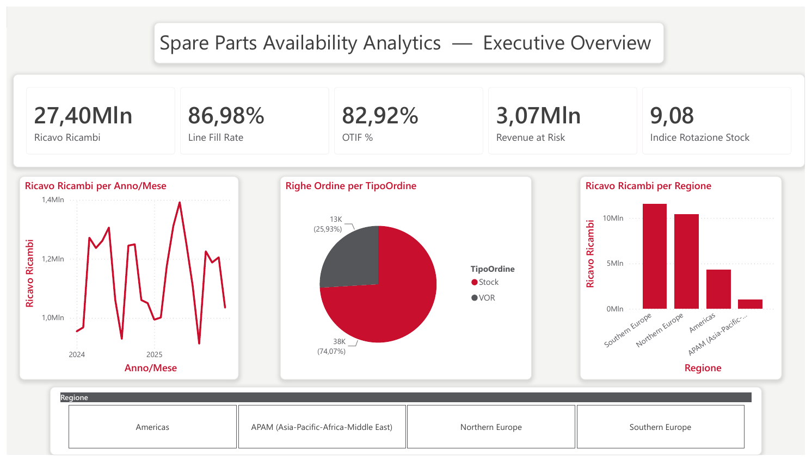
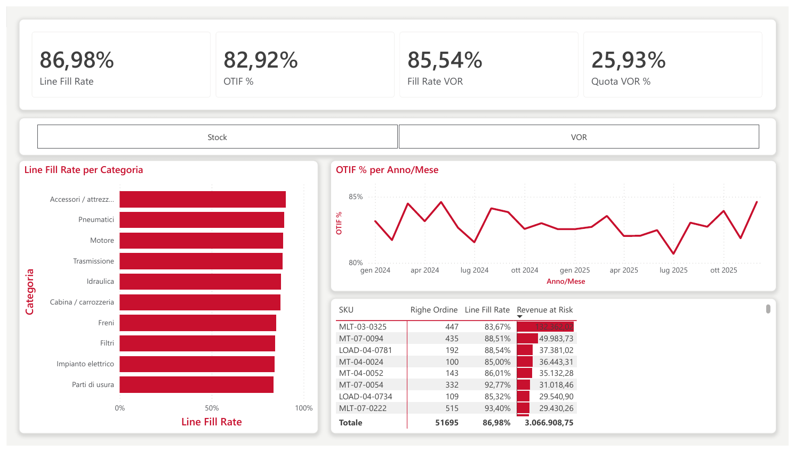
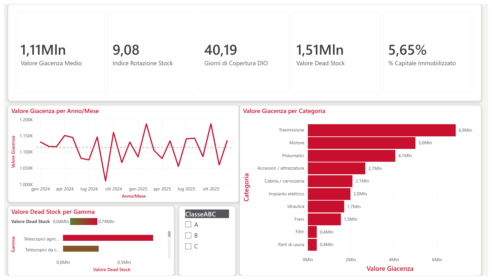
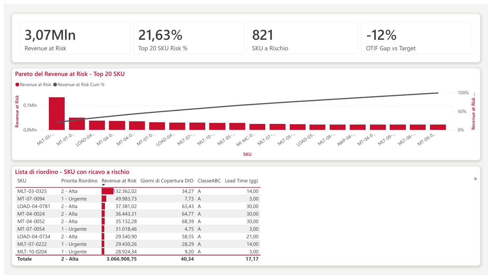

# Spare Parts Availability Analytics — Power BI (Manitou Group)

Progetto di **Business Intelligence / Data Analysis** end-to-end realizzato in Power BI, focalizzato sull'**after-sales** (ricambi) di Manitou Group. Il progetto traduce un'esigenza di business reale in un set di KPI azionabili e quattro dashboard interattive che arrivano fino alla lista d'intervento.

> ⚠️ **Nota sui dati.** I dati **finanziari e strategici** di Manitou citati nel progetto sono **reali e pubblici** (risultati annuali, mix ricavi Prodotti/Servizi, ripartizione geografica). Il **dataset operativo** (ordini ricambi e magazzino) è **simulato** e modellato fedelmente sulla struttura reale dell'azienda (gamme prodotto, brand, segmenti geografici), perché i dati interni non sono pubblici. È un progetto di portfolio a scopo dimostrativo, non affiliato a Manitou.

---

## Il risultato in una riga

Su **3,07 Mln €** di ricavo a rischio distribuiti su **821 SKU**, il **21,6% si concentra in 20 codici**. Non serve alzare il fill rate su tutto il catalogo: ne bastano venti.

---

## Anteprime

**1 — Executive Overview**


**2 — Disponibilità (Service Level)**


**3 — Inventario & Capitale Immobilizzato**


**4 — Azione (Pareto e lista di riordino)**


Il report completo in PDF: [`docs/Report_Manitou_Spare_Parts_Analytics.pdf`](docs/Report_Manitou_Spare_Parts_Analytics.pdf)

---

## Contesto di business

Il piano strategico **"LIFT" (2025-2030)** di Manitou punta a far crescere fortemente i ricavi da servizi e ricambi. Questa crescita dipende da un prerequisito operativo: **avere il pezzo giusto, al momento giusto, nel posto giusto**. Un ricambio non disponibile significa macchina ferma dal cliente (Vehicle Off Road), insoddisfazione e ricavo che scivola verso ricambi non originali.

Il progetto risponde alla domanda: *dove perdiamo disponibilità ricambi, quanto ci costa, e su quali codici intervenire per primi?*

## Le quattro dashboard

1. **Executive Overview** — trend ricavi ricambi, mix ordini Stock vs VOR (urgenti), ricavo per regione, KPI di sintesi.
2. **Disponibilità (Service Level)** — Fill Rate, OTIF, Fill Rate VOR, fill rate per categoria e tabella degli SKU critici per Revenue at Risk.
3. **Inventario & Capitale Immobilizzato** — rotazione stock, giorni di copertura, andamento e composizione della giacenza, dead stock per gamma e classe ABC.
4. **Azione** — Pareto del Revenue at Risk sui primi 20 SKU e **lista di riordino** con priorità calcolata incrociando rischio economico e giorni di copertura residua.

La quarta pagina è quella che chiude il cerchio: le prime tre descrivono il problema, questa dice su cosa intervenire lunedì mattina.

## Cosa dicono i numeri

| Indicatore | Valore | Lettura |
|---|---|---|
| Ricavo ricambi | 27,40 Mln € | perimetro analizzato (2024-2025) |
| Line Fill Rate | 86,98% | righe d'ordine evase complete |
| OTIF | 82,92% | **12 punti sotto** un target di servizio del 95% |
| Revenue at Risk | 3,07 Mln € | ricavo associato a righe non evase |
| Concentrazione | **21,6% in 20 SKU** | la leva è corta, non diffusa |
| Indice di rotazione | 9,08 | |
| Giorni di copertura (DIO) | 40,2 gg | |
| Dead stock | 1,51 Mln € | 5,65% del capitale immobilizzato |

Due osservazioni che emergono dalle dashboard:

- **La giacenza è stabile ma non piatta.** Il valore oscilla di circa ±8% attorno a 1,11 Mln €: sono ~150k € di capitale circolante che si muovono senza una stagionalità evidente.
- **La concentrazione vale su due assi.** Oltre ai 20 SKU critici, la giacenza è concentrata per categoria: Trasmissione da sola vale 6,9 Mln €, più di Motore (5,0) e quasi quanto Pneumatici e Accessori sommati.

## Stack tecnico

- **Power BI Desktop** (modello, report, tema personalizzato)
- **DAX** — 42 misure (fill rate, OTIF, revenue at risk, Pareto e ranking, rotazione, ABC, time intelligence, capitale immobilizzato)
- **Power Query / ETL** — import e pulizia dei CSV
- **Data modeling** — schema a stella (9 tabelle: 6 dimensioni + 3 fact)
- **Data visualization** — formattazione condizionale, barre dati, slicer per pagina, tema brand

### Scelte di visualizzazione

Alcune decisioni prese consapevolmente, utili da discutere in sede di colloquio:

- **Niente grafici a torta sulle categorie.** Con 10 categorie una ciambella costringe a stimare angoli e nasconde le voci in coda dietro lo scroll della legenda. Sostituita con barre orizzontali ordinate per valore. La torta resta in Overview solo sul mix Stock/VOR, dove le fette sono due ed è una lettura parte-tutto legittima.
- **Linea, non istogramma, per la giacenza nel tempo.** Il valore di magazzino è un *livello* misurato a intervalli, non un conteggio di eventi: la codifica corretta è una linea, con media di riferimento. L'asse non parte da zero perché per un livello lo zero non è un riferimento significativo.
- **Gerarchia di pagina costante.** Sintesi (KPI) → diagnosi (grafici) → dettaglio (tabella), così la lettura è la stessa su tutte le pagine.

## Struttura del repository

```
.
├── powerbi/      # File Power BI (.pbix) del report completo
├── data/         # 9 CSV sorgente (modello a stella) — separatore ";", UTF-8
├── dax/          # Misure DAX in formato testo
├── theme/        # Tema Power BI in stile Manitou (JSON)
├── docs/         # Report PDF + documento di progetto + guida alla costruzione
└── screenshots/  # Anteprime delle quattro dashboard
```

## Come aprire il progetto

1. Apri `powerbi/Manitou_Spare_Parts_Analytics.pbix` con **Power BI Desktop** (gratuito).
2. Se i dati non si caricano, aggiorna il percorso della cartella `data/` da *Trasforma dati → Impostazioni origine dati*.
3. Il file `dax/misure_DAX.txt` documenta le misure; `theme/Manitou_Theme.json` è il tema applicato.

Per una lettura rapida senza installare nulla, basta il PDF in `docs/`.

## Modello dati (schema a stella)

| Tabella | Tipo | Contenuto |
|---|---|---|
| `dim_date` | Dim. | Calendario giornaliero 2024-2025 |
| `dim_region` | Dim. | 4 segmenti geografici Manitou |
| `dim_product_family` | Dim. | 8 gamme prodotto (Manitou/Gehl/Mustang) |
| `dim_part_category` | Dim. | 10 categorie ricambio |
| `dim_part` | Dim. | ~880 SKU con classe ABC, mover class, criticità |
| `dim_dealer` | Dim. | Concessionari per regione e tier |
| `fact_parts_orders` | Fact | ~51.700 righe d'ordine ricambi |
| `fact_inventory_snapshot` | Fact | ~21.000 snapshot mensili di magazzino |
| `fact_financials_real` | Fact | Dati finanziari **reali** (contesto) |

## Limiti noti

Dichiarati esplicitamente, perché un progetto onesto vale più di uno che finge di essere completo:

- La lista di riordino indica **su cosa** intervenire e con quale priorità, ma non **quanto** riordinare: servirebbe una regola di scorta minima (punto di riordino, scorta di sicurezza su variabilità della domanda) che il dataset attuale non contiene.
- Il target OTIF del 95% è un riferimento di settore, non un obiettivo ufficiale Manitou.
- I lead time fornitore sono attributi statici per SKU: non c'è storicizzazione né variabilità.

---

**Autore:** Matteo Dominici
**Strumenti:** Power BI · DAX · Power Query · Data Modeling
